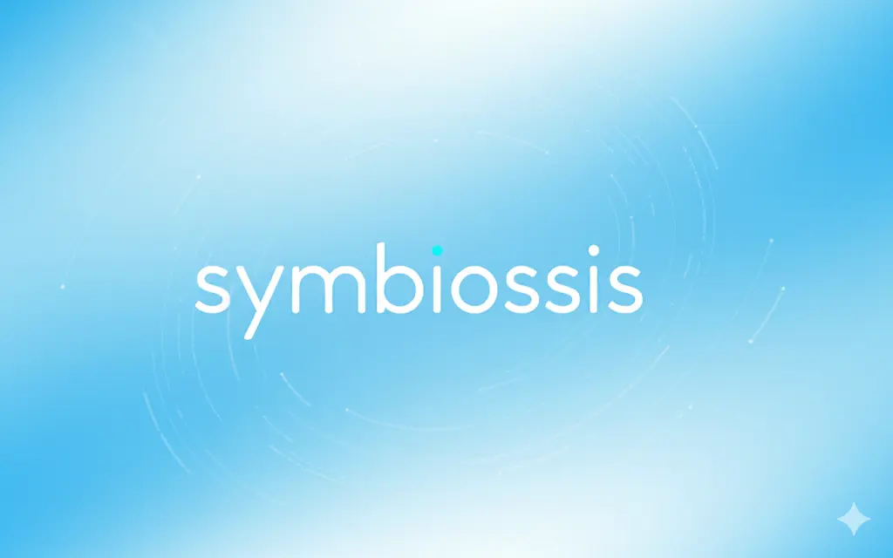
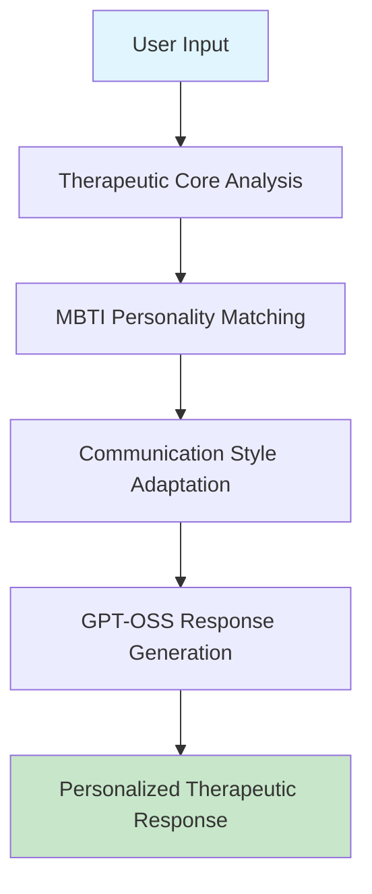

symbiossis/README.md
# Symbiossis - Personalized Therapeutic AI Companion




### 🧠 Revolutionizing Mental Health Support Through Personalized AI Therapy

*Experience truly individualized therapeutic conversations that adapt to your unique personality and communication style*

---

## 🌟 **What Makes Symbiossis Special?**

Symbiossis isn't just another AI chatbot—it's a **personalized therapeutic companion** that understands you. Using advanced MBTI personality analysis and GPT-OSS models, it creates tailored mental health support that feels genuinely human and uniquely yours.

### ✨ **Key Innovations**

| 🎯 **Personality-Driven Therapy** | 🧠 **Intelligent Problem Analysis** | 🔒 **Privacy-First Design** |
|:---:|:---:|:---:|
| Adapts communication style based on your MBTI type | Real-time analysis of mental health concerns | Local processing with optional cloud enhancement |
| **16 unique therapeutic approaches** | **Risk assessment & safety interventions** | **Zero data transmission by default** |

---

## 🚀 **Quick Start**

### Prerequisites
```bash
# Install Ollama for local AI processing
curl -fsSL https://ollama.ai/install.sh | sh
ollama pull gpt-oss:20b
```

### Installation
```bash
git clone https://github.com/yourusername/symbiossis
cd symbiossis
bun install
```

### Setup Environment
```bash
# Pull environment variables from Vercel (optional)
bun run pull-env

# Or create .env.local manually
cp .env.example .env.local
```

### Development
```bash
bun run dev
```

Visit **[http://localhost:3000](http://localhost:3000)** and experience personalized therapeutic AI! 🌱

---

## 🎨 **Features & Capabilities**

### 🧠 **Personality-Driven Therapeutic Adaptation**
- **Hidden MBTI Assessment**: Seamlessly integrated into onboarding as therapeutic preferences
- **16 Personality Types**: From INTJ strategic thinkers to ENFP creative explorers
- **Adaptive Communication**: Each type receives counseling in their preferred style

### 🔍 **Intelligent Problem Analysis Engine**
- **Real-time Analysis**: Identifies anxiety, depression, relationships, stress, and more
- **Risk Assessment**: Automatic crisis detection with appropriate interventions
- **Confidence Scoring**: Quality assurance for therapeutic responses

### 🤖 **GPT-OSS Integration**
- **Dual-Mode Processing**: 20B offline model + 120B online turbo fallback
- **Ollama Framework**: Local-first with seamless cloud enhancement
- **Edge Runtime**: Ultra-low latency responses

### 🛡️ **Therapeutic Safety & Ethics**
- **Crisis Intervention**: Automatic emergency resource recommendations
- **Evidence-Based Techniques**: Grounded in established therapeutic practices
- **Privacy Protection**: Client-side processing with encryption

---

## 🏗️ **Architecture Overview**



### **Core Components**

| Component | Technology | Purpose |
|:---:|:---:|:---:|
| **Frontend** | Next.js 15 + TypeScript | Responsive therapeutic interface |
| **Therapeutic Core** | Custom Engine | Problem analysis & personality adaptation |
| **AI Processing** | GPT-OSS via Ollama | Natural language generation |
| **State Management** | Legend State | Reactive data handling |
| **UI Framework** | Tailwind CSS v4 | Modern, accessible design |

---

## 🎯 **Hackathon Categories**

### 🥇 **Primary: Health & Wellness**
*Revolutionizing accessible mental health support through AI-driven therapeutic conversations*

### 🥈 **Secondary: AI/ML**
*Advanced machine learning for personality-based response adaptation using GPT-OSS models*

### 🥉 **Secondary: Mental Health**
*Evidence-based therapeutic techniques with crisis intervention capabilities*

### 🎖️ **Secondary: Open Source**
*MIT-licensed, transparent mental health technology for global accessibility*

---

## 📊 **Technical Specifications**

### **Model Performance**
- **Offline Mode**: GPT-OSS 20B parameters (~3-8s response time)
- **Online Turbo**: GPT-OSS 120B parameters (~1-3s response time)
- **Automatic Fallback**: Seamless switching based on availability

### **Supported Platforms**
- ✅ **Web Browsers**: Chrome, Firefox, Safari, Edge
- ✅ **Mobile**: Responsive design for all screen sizes
- ✅ **Accessibility**: WCAG 2.1 AA compliant

### **Security & Privacy**
- 🔐 **Client-Side Processing**: No data transmission by default
- 🛡️ **End-to-End Encryption**: For any cloud processing
- 📋 **GDPR Compliant**: User-controlled data retention
- 🚫 **Zero Tracking**: No analytics or data collection

---

## 🎬 **Demonstration**

### **Live Demo Scenarios**
1. **Career Anxiety**: Decision-making support adapted to personality type
2. **Relationship Communication**: Conflict resolution with tailored approaches
3. **Self-Doubt Management**: Motivation strategies based on cognitive preferences

### **Video Presentation**
📹 **[Demo Video Link](https://youtube.com/watch?v=demo-link)** - 3-minute showcase of adaptive therapeutic AI

---

## 🛠️ **Development Commands**

```bash
# Development
bun run dev              # Start development server
bun run build           # Production build
bun run start           # Production server
bun run lint            # Code linting

# Environment Management
bun run pull-env        # Pull env vars from Vercel
bun run pull-env:prod   # Pull from production
bun run pull-env:preview # Pull from preview

# Model Management
ollama pull gpt-oss:20b  # Download local model
ollama serve            # Start Ollama service
```

---

## 📁 **Project Structure**

```
symbiossis/
├── app/                    # Next.js App Router
│   ├── api/               # API routes (completion, status)
│   ├── demo/              # Personality demo page
│   └── page.tsx           # Main therapeutic interface
├── components/            # React components
│   ├── general/          # Core UI components
│   ├── onboarding/       # Assessment flow
│   └── ui/               # Reusable UI elements
├── lib/                  # Core business logic
│   ├── adapters/         # Communication style adaptation
│   ├── helpers/          # Personality & utility functions
│   └── models/           # Therapeutic core engine
├── scripts/              # Utility scripts
│   └── pull-env.sh       # Vercel environment sync
└── public/               # Static assets
```

---

## 🤝 **Contributing**

We welcome contributions! This project is open source and focused on improving mental health accessibility.

### **Ways to Contribute**
- 🐛 **Bug Reports**: Found an issue? Let us know!
- 💡 **Feature Requests**: Have ideas for improvement?
- 🔧 **Code Contributions**: Help enhance the therapeutic engine
- 📚 **Documentation**: Improve setup guides and user docs

### **Development Setup**
```bash
git clone https://github.com/yourusername/symbiossis
cd symbiossis
bun install
bun run pull-env
bun run dev
```

---

## 📄 **License**

**MIT License** - Open source and free to use for mental health initiatives.

```
Copyright (c) 2024 Symbiossis

Permission is hereby granted, free of charge, to any person obtaining a copy
of this software and associated documentation files (the "Software"), to deal
in the Software without restriction, including without limitation the rights
to use, copy, modify, merge, publish, distribute, sublicense, and/or sell
copies of the Software...
```

---

## 🙏 **Acknowledgments**

- **OpenAI & xAI**: For pioneering accessible AI models
- **Ollama Community**: For the incredible local AI framework
- **Mental Health Advocates**: For their tireless work in destigmatizing therapy
- **Hackathon Organizers**: For providing this platform to innovate

---

## 📞 **Contact & Support**

- **GitHub Issues**: [Report bugs & request features](https://github.com/yourusername/symbiossis/issues)
- **Discussions**: [Community forum](https://github.com/yourusername/symbiossis/discussions)
- **Email**: [your.email@example.com](mailto:your.email@example.com)

---

### 🌱 **Experience the Future of Personalized Mental Health Support**

**Symbiossis** - Where AI meets genuine therapeutic care, adapted uniquely for you.

---

*Built with ❤️ for mental health accessibility and AI innovation*

[](https://nextjs.org)
[](https://ollama.ai)
[](https://github.com/yourusername/symbiossis)